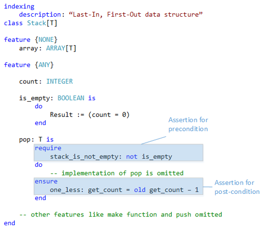

# Guard clause background

[Documentation index](README.md) · [Contributing and building](contributing-and-building.md) · [Structuring checks](structuring-precondition-checks.md) · [Source inclusion](source-code-inclusion.md) · [Assertions](assertion-overview.md) · [Historical performance](historical-performance.md) · **Background**

## What is a guard clause?

Martin Fowler describes guard clauses as a way to replace conditional behavior that obscures a method's normal path. A nested implementation:

```csharp
public double GetPayAmount()
{
    double result;
    if (_isDead)
        result = DeadAmount();
    else if (_isSeparated)
        result = SeparatedAmount();
    else if (_isRetired)
        result = RetiredAmount();
    else
        result = NormalPayAmount();

    return result;
}
```

can be flattened with early returns:

```csharp
public double GetPayAmount()
{
    if (_isDead)
        return DeadAmount();
    if (_isSeparated)
        return SeparatedAmount();
    if (_isRetired)
        return RetiredAmount();

    return NormalPayAmount();
}
```

The guards make the exceptional cases explicit and leave the normal path visually clear. A guard clause does not inherently throw an exception; it can return, continue, or otherwise leave the current path.

## Design by contract

Many guard clauses used in application and library code are precondition or invariant checks and do throw when an input or state is invalid. Bertrand Meyer described these concepts as part of **Design by Contract** in his book **Object-Oriented Software Construction**:

- **Preconditions** define what must be true before an operation runs.
- **Postconditions** define what must be true about its result and effects.
- **Class invariants** define valid object state at stable points in an object's lifetime.
- **Loop invariants and variants** help express and establish loop correctness.

Eiffel integrates these contracts into the language. Its routines can declare Boolean preconditions and postconditions, and a contract-enabled runtime reports violations:



Light.GuardClauses focuses on the common .NET use case: concise precondition and state checks near the beginning of a method, protecting the method's main behavior from invalid values. For Fowler's refactoring example, see [Replace Nested Conditional with Guard Clauses](https://refactoring.com/catalog/replaceNestedConditionalWithGuardClauses.html). For Meyer's original material, see the archived [Object-Oriented Software Construction](https://archive.eiffel.com/doc/oosc/).
